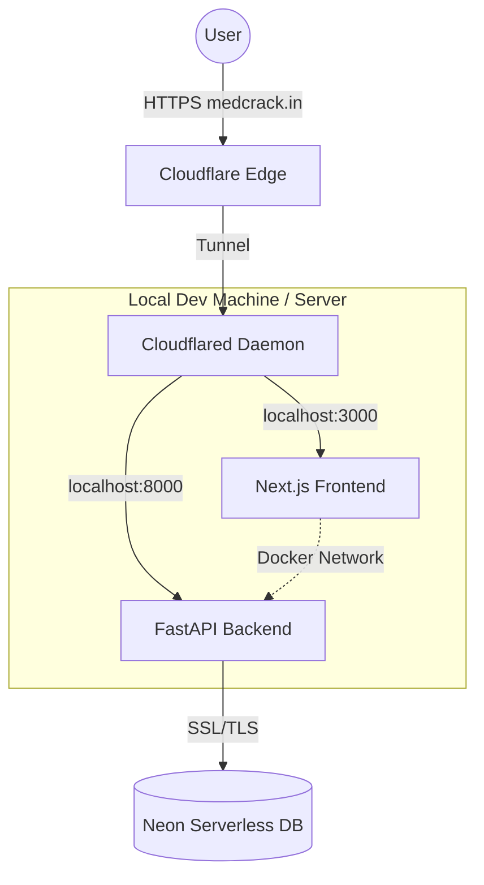

# MED-CRACK 🏥

**AI-Powered Medical Entrance Preparation Platform**

MED-CRACK is a modern, full-stack web application designed to help medical aspirants prepare for NEET. It features AI-generated questions, performance analytics, and a seamless user experience.

---

## 🏗️ Architecture & DevOps

This project uses a **Professional Local Hybrid Cloud Architecture**. It combines the ease of local development with the power of cloud-native connectivity.

### The Stack
- **Frontend**: [Next.js 14](https://nextjs.org/) (App Router) - Responsive, server-rendered UI.
- **Backend**: [FastAPI](https://fastapi.tiangolo.com/) (Python) - High-performance async API.
- **Database**: [PostgreSQL (Neon)](https://neon.tech/) - Serverless cloud database.
- **Orchestration**: Docker Compose - Manages unified service lifecycle.
- **Networking**: Cloudflare Tunnel - Secure public exposure without port forwarding.

### Architecture Flow



### Why this Architecture?
1.  **Containerization (Docker)**: Guarantees the app runs exactly the same on your laptop as it would on a production AWS EC2 instance. No "it works on my machine" issues.
2.  **Separate Frontend/Backend**: Decoupling allows independent scaling. The frontend handles SSR/SEO, while the backend focuses on pure data logic and AI processing.
3.  **Cloudflare Tunnel**: Provides Enterprise-grade security (DDoS protection, SSL) instantly for a local server, avoiding dangerous router port forwarding.

---

## 🚀 Setting Up on a Fresh System

Follow these steps to get the application running from zero.

### Prerequisites
- [Docker Desktop](https://www.docker.com/products/docker-desktop/) installed and running.
- [Git](https://git-scm.com/) installed.
- (Optional) `cloudflared` if you want public internet access.

### 1. Clone the Repository
```bash
git clone <repository_url>
cd MED-CRACK
```

### 2. Configure Environment
Create a `.env` file in the root (or standard environment variables) if needed, but primarily ensure your `docker-compose.yml` has the correct `NEXT_PUBLIC_BACKEND_URL` build argument.

**Important Environment Variables:**
- `DATABASE_URL`: Connection string for your Neon PostgreSQL DB.
- `NEXT_PUBLIC_BACKEND_URL`: The public URL where the backend will be accessible (e.g., `https://api.medcrack.in`).

### 3. Build and Run
We use Docker Compose to spin up the entire stack with one command.

```bash
# Build the images (this bakes the env vars into the frontend)
docker-compose build --no-cache

# Start the services in detached mode
docker-compose up -d
```

### 4. Verify Installation
- **Frontend**: Visit `http://localhost:3000`
- **Backend**: Visit `http://localhost:8000/docs` (Swagger UI)

---

## ☁️ Public Access (DevOps Flow)

To make your local host accessible to the world (like `medcrack.in`), we use Cloudflare Tunnel.

**Run the tunnel:**
```bash
cloudflared tunnel run medcrack
```

**Traffic Flow:**
1.  User visits `medcrack.in`.
2.  Request hits Cloudflare Edge.
3.  Cloudflare routes traffic through the encrypted tunnel to your local machine.
4.  `cloudflared` on your machine forwards traffic to Docker ports (`3000` or `8000`).

---

## 🛠️ Common Commands

| Action | Command |
| :--- | :--- |
| **Start App** | `docker-compose up -d` |
| **Stop App** | `docker-compose down` |
| **View Logs** | `docker-compose logs -f` |
| **Rebuild Frontend** | `docker-compose build --no-cache frontend` |
| **Shell Access (Backend)** | `docker-compose exec backend /bin/sh` |

## 🐞 Troubleshooting
- **"Failed to fetch"**: Ensure `NEXT_PUBLIC_BACKEND_URL` matches your actual public URL and was present during the build phase.
- **Latency**: If the app is slow locally, check the ping to your database region. Ideally, host the DB closer to the backend.